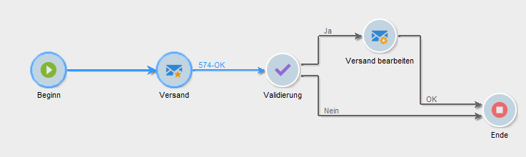

# Lebenszyklus eines Workflows {#workflow-life-cycle}

Der Lebenszyklus eines Workflows gestaltet sich in drei Hauptetappen:

* **In Bearbeitung**

  Hierbei handelt es sich um die Phase der Erstellung. Wenn ein Workflow neu erstellt wird, ist er im Bearbeitungsstatus. Ein solcher Workflow wurde noch nicht vom Server übernommen und kann daher problemlos geändert werden.

* **Gestartet**

  Nach Abschluss der Erstellungsphase kann der Workflow gestartet werden. In dieser Phase wird die Instanz vom Server verarbeitet und die einzelnen Aufgaben werden ausgeführt. Der Workflow kann – mit bestimmten Vorsichtsmaßnahmen – immer noch geändert werden.

* **Abgeschlossen**

  Ein Workflow ist abgeschlossen, wenn keine Aufgaben mehr zur Verarbeitung anstehen, oder wenn ein Benutzer die Workflow-Instanz ausdrücklich angehalten hat.

Beispielsweise sind im unten stehenden Workflow die Aktivitäten **Beginn** und **Versand** umrandet und die Aktivität **Validierung** blinkt.

Dies bedeutet, dass die ersten beiden Aktivitäten erfolgreich ausgeführt wurden und dass die Validierungsaktivität in Gang ist, d. h. sie wurde erstellt, ist aber noch nicht abgeschlossen.

Oberhalb der Transition nach der Aktivität **Versand** werden die Zeichen **574 - OK** angezeigt. Daran ist erkennbar, dass bei der Versandvorbereitung 574 Empfängerinnen und Empfänger ausgewählt wurden und dass der Vorgang korrekt abgeschlossen wurde. Diese Informationen, die den Transitionen bei ihrer Ausführung hinzugefügt werden, werden von den Aktivitäten berechnet, die Daten verarbeiten.

Der Workflow wartet also auf die Entscheidung eines Benutzers, der der Gruppe angehört, welche in der **Validierung**-Aktivität ausgewählt wurde. Gruppenmitglieder, deren E-Mail-Adresse oder Mobiltelefonnummer in ihrem Profil gespeichert sind, werden über die entsprechenden Kanäle benachrichtigt.

Die Benutzerverwaltung wird in diesem [Abschnitt](../../platform/using/access-management.md) beschrieben.

Weitere Informationen zur Überwachung Ihrer Workflows finden Sie in [diesem Abschnitt](monitoring-workflow-execution.md).
