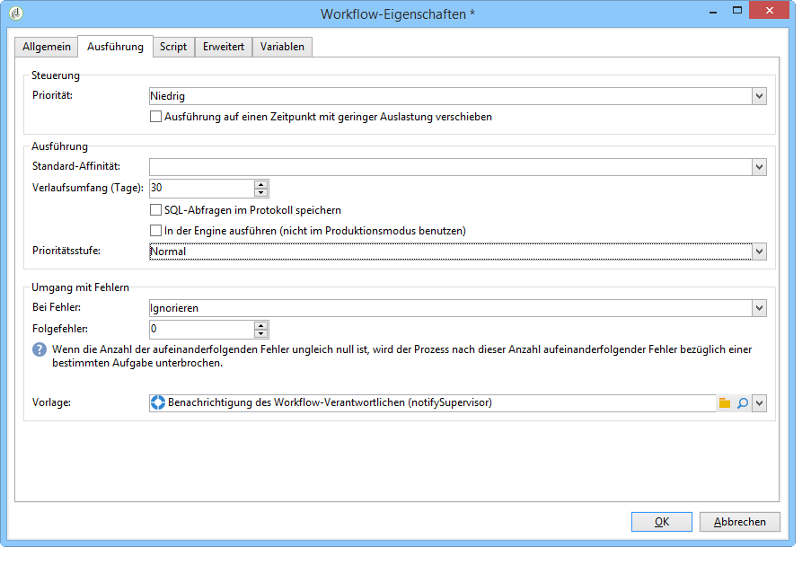
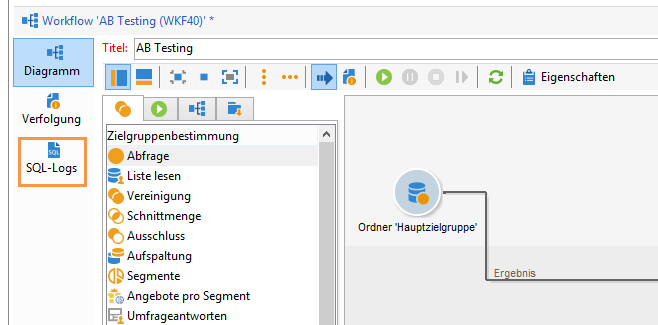

# Workflow-Eigenschaften{#workflow-properties}

## Ausführungs-Tab {#execution-tab}

Der Tab **[!UICONTROL Ausführung]** im Fenster der Workflow-**[!UICONTROL Eigenschaften]** enthält drei Bereiche:

### Planung {#scheduler}

Dieser Bereich wird nur in Kampagnen-Workflows angezeigt.

* **[!UICONTROL Versandpriorität]**

  Die Workflow-Engine verarbeitet anstehende Workflows gemäß der in diesem Feld angegebenen Priorität. So werden beispielsweise alle Workflows mit einer **[!UICONTROL mittleren]** Priorität vor Workflows mit einer **[!UICONTROL niedrigen]** Priorität ausgeführt.

* **[!UICONTROL Ausführung auf einen Zeitpunkt mit geringer Auslastung verschieben]**

  Diese Option verschiebt den Workflow-Start in einen weniger ausgelasteten Zeitraum. Einige Workflows können Ressourcen für die Datenbank-Engine kosten. Es wird empfohlen, die Ausführung für eine Zeit geringer Aktivität (z. B. nachts) zu planen. Zeiten mit geringer Auslastung werden im technischen Workflow **[!UICONTROL Kampagnenprozesse]** definiert.

### Ausführung {#execution}

* **[!UICONTROL Standard-Affinität]**

  Wenn Ihre Installation mehrere Workflow-Server umfasst, wählen Sie in diesem Feld den Computer aus, auf dem der Workflow ausgeführt werden soll. Wenn der in diesem Feld definierte Wert auf keinem Server vorhanden ist, bleibt der Workflow ausstehend.

  Weitere Informationen finden Sie in diesem [Installationshandbuch zu Campaign Classic v7](../../installation/using/configuring-campaign-server.md#high-availability-workflows-and-affinities).

* **[!UICONTROL Verlaufsumfang (Tage)]**

  Die Arbeitstabellen der Datenbank speichern den Verlauf der Ausführungen (Aufgaben, Ereignisse, Protokoll). Hier können Sie die Anzahl der Tage festlegen, die für diesen Workflow archiviert werden sollen: Der Bereinigungsprozess löscht die ältesten Archive einmal täglich. Wenn der Wert in diesem Feld null ist, wird das Archiv nie gelöscht.

* **[!UICONTROL SQL-Abfragen im Protokoll speichern]**

  Diese Funktion ist erfahrenen Benutzerinnen und Benutzern vorbehalten. Dies betrifft Workflows, die Zielgruppenbestimmungsaktivitäten enthalten (Abfrage, Vereinigung, Schnittmenge usw.). Wenn diese Option aktiviert ist, werden die SQL-Abfragen, die während der Workflow-Ausführung an die Datenbank gesendet werden, in Adobe Campaign angezeigt: Dies bedeutet, dass Sie sie analysieren können, um Abfragen zu optimieren oder Probleme zu diagnostizieren.

  Abfragen werden in diesem Fall in der Registerkarte **[!UICONTROL SQL-Logs]** angezeigt, die dem Workflow (außer bei Kampagnen-Workflows) und der Aktivität **[!UICONTROL Eigenschaften]** hinzugefügt wird. Die Registerkarte **[!UICONTROL Audit]** enthält auch SQL-Abfragen.

  

* **[!UICONTROL In der Engine ausführen]**

  Diese Option kann nur zum Debuggen verwendet werden und nie in der Produktionsumgebung. Wenn er aktiviert ist, hat der Workflow Priorität und alle anderen Workflows werden angehalten, bis dieser beendet ist.

### Umgang mit Fehlern {#error-management}

* **[!UICONTROL Fehlerbehebung]**

  In diesem Feld können Sie festlegen, welche Aktionen ausgeführt werden sollen, wenn eine Workflow-Aufgabe Fehler aufweist. Es gibt zwei mögliche Optionen:

   * **[!UICONTROL Prozess anhalten]**: der Workflow wird automatisch angehalten. Der Workflow-Status ändert sich in **[!UICONTROL Fehlgeschlagen]**. Sobald das Problem behoben ist, starten Sie den Workflow mit der Schaltfläche **[!UICONTROL Starten]** oder **[!UICONTROL Neustart]** neu.
   * **[!UICONTROL Ignorieren]**: Der Status der Aufgabe, die den Fehler ausgelöst hat, ändert sich in **[!UICONTROL Fehlgeschlagen]** der Workflow behält jedoch den Status **[!UICONTROL Gestartet]**. Diese Konfiguration ist für wiederkehrende Aufgaben relevant: Wenn die Verzweigung über eine Planungsaktivität verfügt, wird diese bei der nächsten Ausführung des Workflows normal gestartet.

* **[!UICONTROL Folgefehler]**

  Dieses Feld wird verfügbar, wenn der **[!UICONTROL Ignorieren]**-Wert im Feld **[!UICONTROL Bei Fehlern]** ausgewählt ist. Sie können die Anzahl der Fehler angeben, die ignoriert werden können, bevor der Prozess angehalten wird. Sobald diese Zahl erreicht ist, wechselt der Workflow-Status zu **[!UICONTROL Fehlgeschlagen]**. Wenn der Wert dieses Felds 0 beträgt, wird der Workflow unabhängig von der Fehleranzahl nie angehalten.

* **[!UICONTROL Template]**

  Geben Sie in diesem Feld die Vorlage für die Benachrichtigung an, die die Workflow-Verantwortlichen erhalten, wenn ein Workflow den Status **[!UICONTROL Fehlgeschlagen]** annimmt.

  Die betroffenen Benutzenden werden per E-Mail benachrichtigt, wenn ihr Profil eine E-Mail-Adresse enthält. Um Workflow-Verantwortliche zu definieren, gehen Sie in den Eigenschaften zum Feld **[!UICONTROL Verantwortliche]** (Registerkarte **[!UICONTROL Allgemein]**).

  

  Die Standardvorlage **[!UICONTROL Benachrichtigung des Workflow-Verantwortlichen]** enthält einen Link, die den Webzugriff auf die Adobe Campaign-Konsole ermöglicht. Auf diese Weise kann der Supervisor nach Anmeldung in den fehlgeschlagenen Workflow eingreifen.

  Sie haben die Möglichkeit, im Knoten **[!UICONTROL Administration > Kampagnen > Vorlagen technischer Sendungen]** eine eigene Vorlage zu erstellen.
