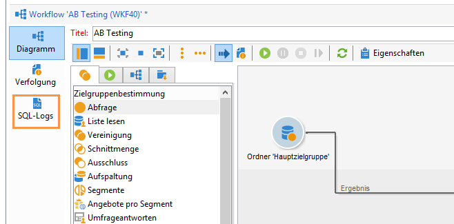

# Workflow-Eigenschaften {#workflow-properties}

## Ausführungstab {#execution-tab}

The **[!UICONTROL Execution]** tab of the **[!UICONTROL Properties]** window in a workflow is broken down into 3 sections:

### Planung {#scheduler}

Dieser Bereich wird nur in Kampagnen-Workflows angezeigt.

* **[!UICONTROL Priority]**

   Die Workflow-Engine verarbeitet die auszuführenden Workflows anhand des in diesem Feld definierten Prioritätskriteriums. Beispielsweise werden alle Arbeitsabläufe mit einer **[!UICONTROL Average]** Priorität vor denen mit einer **[!UICONTROL Low]** Priorität ausgeführt.

* **[!UICONTROL Schedule execution for a time of low activity]**

   Diese Option verschiebt den Workflow-Start auf einen weniger aktiven Zeitraum. Einige Arbeitsabläufe können im Hinblick auf Ressourcen für die Datenbank-Engine teuer sein. Wir empfehlen die Ausführung der Zeitplanung für eine Zeit niedriger Aktivität (z.B. in der Nacht). Die Zeiträume mit geringer Aktivität werden im **[!UICONTROL Processes on campaigns]** technischen Arbeitsablauf definiert.

### Ausführung {#execution}

* **[!UICONTROL Default affinity]**

   Verwenden Sie dieses Feld, wenn Ihre Installation mehrere Workflow-Server aufweist, um festzulegen, auf welchem Server der Workflow laufen soll. Sollte der in diesem Feld angegebene Wert auf keinem Server existieren, bleibt der Workflow im Stand-by.

   Siehe diesen [Abschnitt](../../installation/using/configuring-campaign-server.md#high-availability-workflows-and-affinities).

* **[!UICONTROL History in days]**

   In den Arbeitstabellen der Datenbank werden der Ausführungsverlauf von Aufgaben und Ereignissen sowie das Protokoll gespeichert. Geben Sie hier an, wie lange der Verlauf für diesen Workflow beibehalten werden soll. Die in der Datenbank enthaltenen Bereinigungsprozesse löschen jeden Tag die obsoleten Verläufe. Bei Angabe von Null wird der Verlauf nie gelöscht.

* **[!UICONTROL Log SQL queries in the journal]**

   Diese Funktion richtet sich an erfahrene Benutzer. Sie betrifft Workflows mit Zielgruppenbestimmungs-Aktivitäten (Abfrage, Vereinigung, Schnittmenge usw.). Wenn diese Option aktiviert wurde, werden die bei Ausführung des Workflows an die Datenbank gesendeten SQL-Abfragen in Adobe Campaign gespeichert. Auf diese Weise haben Sie die Möglichkeit, die Abfragen zu analysieren und eventuelle Probleme zu erkennen.

   Abfragen werden auf einer **[!UICONTROL SQL logs]** Registerkarte angezeigt, die dem Workflow (mit Ausnahme von Kampagnen-Workflows) und der Aktivität hinzugefügt wird, wenn die Option aktiviert ist **[!UICONTROL Properties]** . Die **[!UICONTROL Audit]** Registerkarte enthält auch SQL-Abfragen.

   

* **[!UICONTROL Execute in the engine]**

   Diese Option darf nur zur Problembehebung verwendet werden und nie im Produktionsalltag. Bei Aktivierung der Option wird der Workflow prioritär. Alle anderen Workflows werden bis zu seinem Abschluss von der Workflow-Engine angehalten.

### Umgang mit Fehlern  {#error-management}

* **[!UICONTROL Troubleshooting]**

   In diesem Feld können Sie angeben, welche Aktion ausgeführt werden soll, wenn eine Workflow-Aufgabe einen Fehler ausgibt. Zwei Optionen stehen zur Verfügung:

   * **[!UICONTROL Stop the process]**: Der Workflow wird automatisch angehalten. Der Workflow-Status ändert sich in **[!UICONTROL Failed]**. Nachdem das Problem behoben wurde, starten Sie den Workflow mit den **[!UICONTROL Start]** oder **[!UICONTROL Restart]** Schaltflächen neu.
   * **[!UICONTROL Ignore]**: Der Status der Aufgabe, die den Fehler ausgelöst hat, ändert sich in **[!UICONTROL Failed]**, der Workflow behält jedoch den **[!UICONTROL Started]** Status bei. Diese Konfiguration ist für wiederkehrende Aufgaben relevant: Wenn die Verzweigung einen Scheduler enthält, wird sie beim nächsten Ausführen des Workflows normal gestartet.

* **[!UICONTROL Consecutive errors]**

   Dieses Feld wird verfügbar, wenn der **[!UICONTROL Ignore]** Wert im **[!UICONTROL In case of errors]** Feld ausgewählt ist. Sie können die Anzahl der Fehler angeben, die ignoriert werden können, bevor der Prozess beendet wird. Sobald diese Zahl erreicht ist, ändert sich der Workflow-Status in **[!UICONTROL Failed]**. Wenn der Wert dieses Felds 0 beträgt, wird der Workflow unabhängig von der Anzahl der Fehler nie beendet.

* **[!UICONTROL Template]**

   This field lets you select the notification template to be sent to the workflow supervisors when its status changes to **[!UICONTROL Failed]**.

   Die betroffenen Betreiber werden per E-Mail benachrichtigt, wenn sich in ihrem Profil eine E-Mail-Adresse befindet. Um Workflow-Aufsichtsbehörden zu definieren, wechseln Sie zum **[!UICONTROL Supervisor(s)]** Feld der Eigenschaften (**[!UICONTROL General]** Registerkarte).

   

   The **[!UICONTROL Notification to a workflow supervisor]** default template includes a link for accessing the Adobe Campaign console via the Web so that the recipient can work on the issue once they are logged on.

   Um eine personalisierte Vorlage zu erstellen, gehen Sie zu **[!UICONTROL Administration>Campaign management>Technical deliveries and templates]**.

